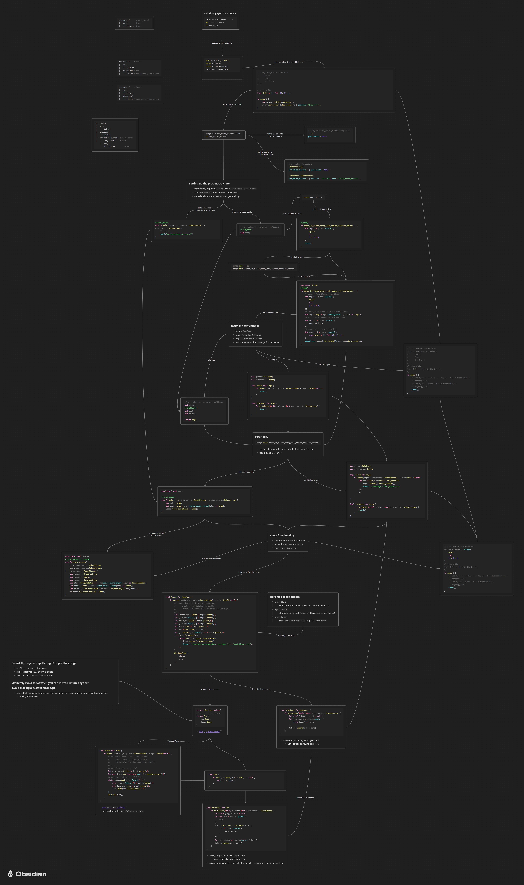

# Babby's first proc macro

**Goal**: write a type alias shortcut for arrays

```rust
array_maker::alias!(
    MyArr,
    f32,
    2 * 3 * 4,
);
/* will write
type MyArr = [[[f32; 4]; 3]; 2];
e.g.,
[
    [
        [0, 1, 2, 3],
        [4, 5, 6, 7],
        [8, 9, 10, 11]
    ],
    [
        [12, 13, 14, 15],
        [16, 17, 18, 19],
        [20, 21, 22, 23]
    ]
]
*/
```

**Side-quest**: write an attribute macro that reverses the order of parameters in a function signature

```rust
#[array_maker::reorder(reverse)]
fn foo(x: X, y: Y) -> Z { todo!() }
/* will write
fn foo(y: Y, x: X) -> Z { todo!() }
*/
```


